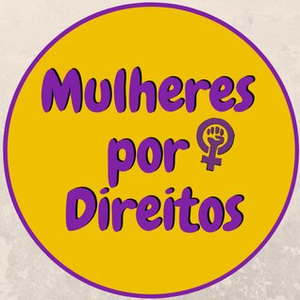

# Repositório com análises exploratórias de perfis de eleitores e candidatos em SCS(2020)

  

## Projeto: 
- Projeto voluntário em apoio à candidatura coletiva "Mulheres por + Direitos" ao cargo de vereador.
- Análise exploratória dos dados eleitorais de eleitores e candidatos a vereador no munícipio de São Caetano do Sul no ano de 2020.
- Servir como base de insights para criação de conteúdo conforme o público identificado.
